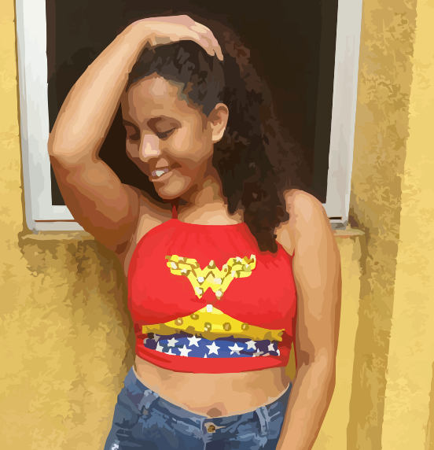

Essa é minha página na WEB.

# Quem sou eu?
---
Sou aluna do terceiro ano de programação de Jogos Digitais, faço o IFRN no campus Ceará-Mirim. Sou desenvolvedora de jogos, tenho conhecimentos em Photoshop, Animate, CorelDRAW, Audacity, Construct 2 e outros aplicatavos, como o DEV e NetBeans, que eu uso para programar em C/C++ e Java, respectivamente. Tenho 16 anos, e amo o que eu faço. 

Sou a mulher maravilha nos tempos vagos, mas não conta para ninguém, segredinho nosso...

# Portifólio 
***

Esse portifólio é uma exigência do professor Marcelo Barros, para complentar a nota do quarto bimestre da disciplina de motores, e aqui exibirei minhas experiências na área de jogos, projetos e outras coisas relevantes sobre mim.    

## Games 
***
![[JOGO1]](https://julianabl.github.io/Ventania/]

## Artes 
***
## Empresas 
***
      ***             ***   

## Projetos 

**Aceitação e valorização da cultura Afro    
**Equipe de comunicação do campus Ceará-Mirim 
**Limpeza do rio Maceió 

* * *
#s Uma ou mais hashtags criam capítulos ou subcapítulos 

** 

