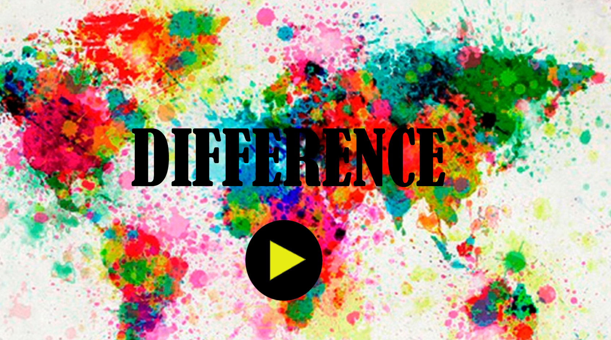
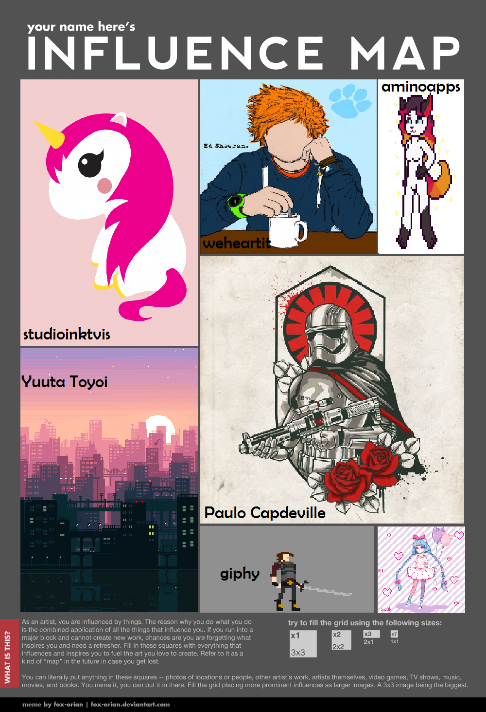

Esse é meu portifólio, olha meus trabalhinhos...

# Informações Pessoais: 
---
Meu nome é Tereza Martins e faz 16 anos que concilio a vida de heroína e humana, além de programar Jogos Digitais. 

# Portifólio 
***

Esse portifólio é uma exigência do professor Marcelo Barros, para completar a nota do quarto bimestre da disciplina de motores, e aqui exibirei minhas experiências na área de jogos, projetos e outras coisas relevantes sobre mim.    

## Games 

-DIFFERENCE

Foi meu primeiro jogo, é um jogo de terceira pessoa, onde o jogador viaja pelo mundo e tem que pegar elementos culturais de cada país para passar de fase. 

-VENTANIA

Foi o segundo jogo da matéria de Oficina de Jogos, nesse jogo você precisa organizar as cartas na caixa de correio e assim combinar as cores das cartas, igual a da caixa. 

-THE JOURNEY

Terceiro jogo proposto na matéria de Oficina, o objetivo do jogo é simular que você é uma mãe que precisa de ajuda, para cuidar do seu bebê.

***
## Mapa de influência
Um artista de verdade sempre têm boas referências para usar de inspiração, e para organizar essas ideias usamos um mapa de influência. 

## Empresas 
***
       

Café com leite: Minha primeira empresa. 

Cotton Candy Game: Minha segunda empresa.

Triangle Games: Minha terceira empresa. 

## Projetos 
***
-Faço parte da Equipe de Comunicação do IFRN, campus Ceará-Mirim.

-Sou integrante de um projeto sobre a aceitação e valorização da cultura Afro. 

-Participei e ministrei cursos na I Expotec - Campus Ceará-Mirim.

-Estou fazendo um jogo para o RPP sobre a escravidão, tendo como Orientador o professor Ricardo (professor de história). 

## Contatos
***
Email: tereza.cm01@gmail.com (pessoal) / princesadigital01@gmail.com (para trabalho)

